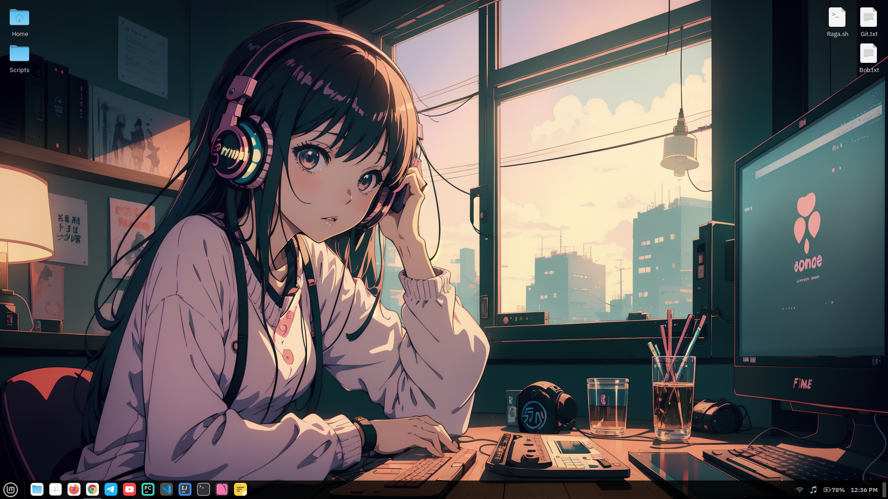
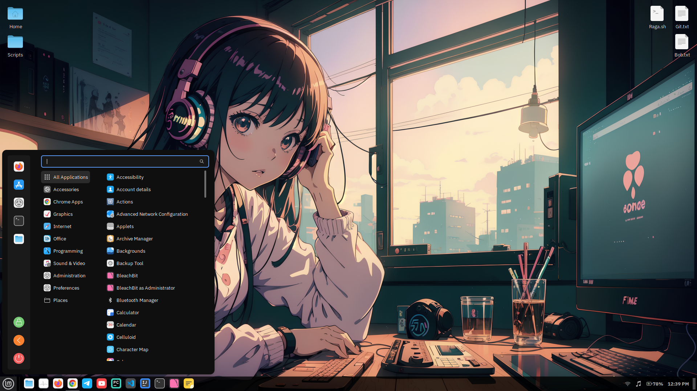
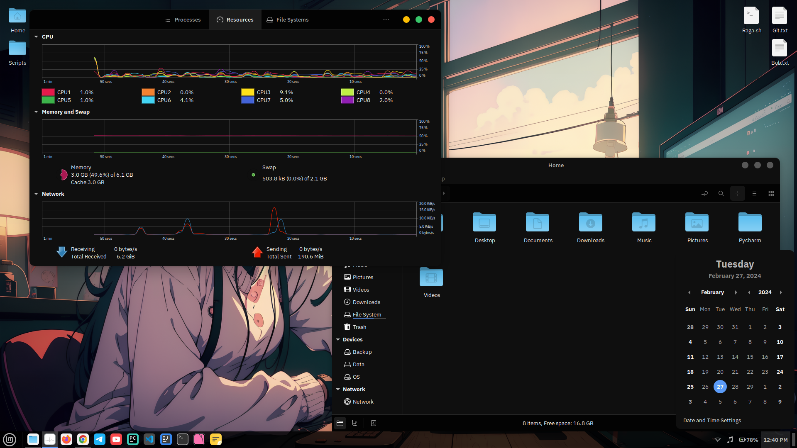
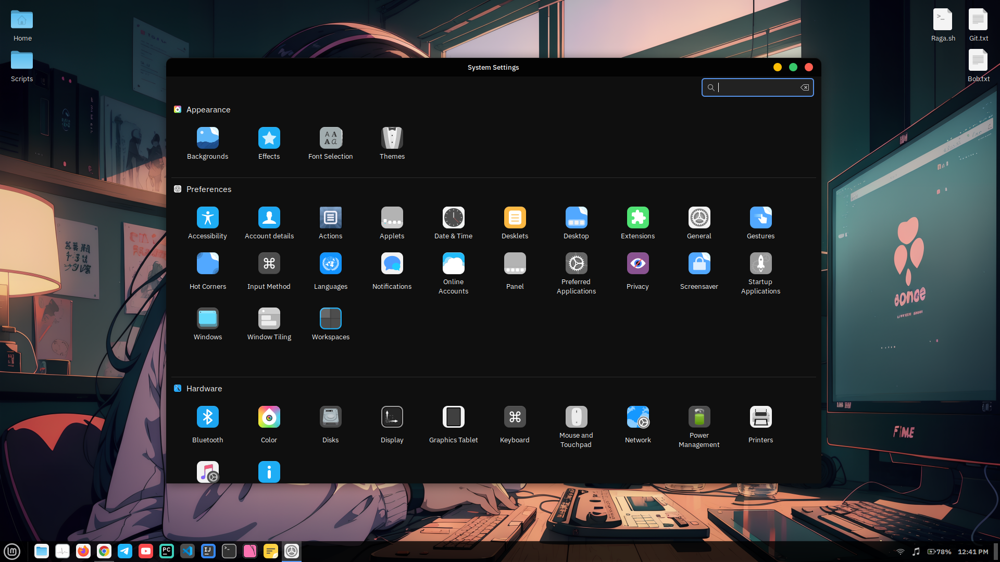

# Linux Mint Dotfiles

```sh
git clone --depth 1 https://github.com/sakshiagrwal/dotfiles.git && cd dotfiles && ./setup.sh
```

## 1. System update

## 2. Git setup

## 3. Set battery charging threshold

-   Download the `battery-threshold.service` file and enable the service.

    ```sh
    sudo wget -q -O /etc/systemd/system/battery-threshold.service https://raw.githubusercontent.com/sakshiagrwal/Scripts/dev/Linux/etc/systemd/system/battery-threshold.service && sudo systemctl enable --now battery-threshold.service
    ```

    This extends your laptop battery lifespan by setting charging thresholds using the provided service file.

## 4. Configure Firefox

-   Configuration files: [autoconfig.js](https://github.com/sakshiagrwal/Scripts/blob/main/Windows/Extra/autoconfig.js), [firefox.cfg](https://github.com/sakshiagrwal/Scripts/blob/dev/Linux/usr/lib/firefox/firefox.cfg), [policies.json](https://github.com/sakshiagrwal/Scripts/blob/dev/Linux/usr/lib/firefox/distribution/policies.json)

    ```sh
    sudo wget -q -O /usr/lib/firefox/defaults/pref/autoconfig.js https://raw.githubusercontent.com/sakshiagrwal/Scripts/dev/Linux/usr/lib/firefox/defaults/pref/autoconfig.js && sudo wget -q -O /usr/lib/firefox/firefox.cfg https://raw.githubusercontent.com/sakshiagrwal/Scripts/dev/Linux/usr/lib/firefox/firefox.cfg && sudo wget -q -O /usr/lib/firefox/distribution/policies.json https://raw.githubusercontent.com/sakshiagrwal/Scripts/dev/Linux/usr/lib/firefox/distribution/policies.json
    ```

-   Apply theme: [Firefox-Mod-Blur](https://github.com/datguypiko/Firefox-Mod-Blur)

    ```sh
    cd ~/.mozilla/firefox/*.default-release/ && git clone --depth 1 https://github.com/datguypiko/Firefox-Mod-Blur chrome && cd chrome/ && rm -rf !(ASSETS|*.css) .[^.]*
    ```

## 5. Colloid themes

-   [Colloid-gtk-theme](https://github.com/vinceliuice/Colloid-gtk-theme) `$HOME/.themes`

    ```sh
    git clone --depth 1 https://github.com/vinceliuice/Colloid-gtk-theme && cd Colloid-gtk-theme && ./install.sh -c dark --tweaks black rimless && cd .. && rm -rf Colloid-gtk-theme
    ```

-   [Colloid-icon-theme](https://github.com/vinceliuice/Colloid-icon-theme) `$HOME/.local/share/icons`

    ```sh
    git clone --depth 1 https://github.com/vinceliuice/Colloid-icon-theme && cd Colloid-icon-theme && ./install.sh && cd .. && rm -rf Colloid-icon-theme
    ```

## 6. [Capitaine-cursors](https://github.com/keeferrourke/capitaine-cursors)

-   Installe capitaine-cursors [patched version](https://github.com/sainnhe/capitaine-cursors) `$HOME/.icons`

    ```sh
    wget -q --show-progress https://github.com/sainnhe/capitaine-cursors/releases/download/r5/Linux.zip && unzip -q Linux.zip -d Capitaine-Cursors && cd Capitaine-Cursors/ && mv 'Capitaine Cursors' ~/.icons/Capitaine-Cursors && cd .. && rm -rf Capitaine-Cursors Linux.zip
    ```

## 7. Installing fonts

Install the following fonts `$HOME/.local/share/fonts`

-   `Default Font`, `Desktop Font`, `Document Font`: [IBM Plex Sans Regular 10](https://fonts.google.com/specimen/IBM+Plex+Sans)
-   `Window Title Font`: [IBM Plex Sans Medium 10](https://fonts.google.com/specimen/IBM+Plex+Sans)
-   `Monospace Font`: [JetBrains Mono Regular 10](https://www.jetbrains.com/lp/mono)

Optional Fonts:

-   [Fira Code (Nerd Fonts)](https://github.com/ryanoasis/nerd-fonts/releases/latest)
-   [Roboto Condensed](https://fonts.google.com/specimen/Roboto+Condensed)
-   [Inter](https://fonts.google.com/specimen/Inter)

---

## Linux Mint Installation and Configuration

-   Kernel version `6.2.0-39-generic` is confirmed to work well with `Linux Mint 21.3` and the specified hardware.
-   If experiencing touchpad lag, install the Synaptics driver **(Note: Kernel version `6.2.0-39-generic` resolves this issue)**.

    ```sh
    apt install xserver-xorg-input-synaptics
    ```

    Refer to the [Linux Mint Release Notes](https://linuxmint.com/rel_virginia.php) for more details.

## Dual-Booting with Windows

When setting up a dual-boot system:

-   Always install Windows first, followed by Linux Mint.
-   Refer to the [Linux Mint Installation Guide](https://linuxmint-installation-guide.readthedocs.io/en/latest/multiboot.html) for detailed instructions.

## Adjusting Screen Contrast with `xgamma` and `xrandr`

Adjust the screen contrast using the `xgamma` and `xrandr` commands. For more detailed information, you can refer to this [ask Ubuntu](https://askubuntu.com/questions/91195/how-do-i-adjust-the-screen-contrast) thread.

-   Using `xgamma`:

    ```sh
    xgamma -gamma 0.85
    ```

    This command sets the gamma value to `1.05`, affecting overall screen contrast and brightness.

-   Using `xrandr`:

    ```sh
    xrandr --output eDP --gamma 0.8:0.8:0.8
    ```

    Here, the values `0.8:0.8:0.8` represent the gamma correction for the red, green, and blue channels, respectively. Experiment with these values to achieve the desired contrast and color balance.

**Please be aware that these changes are temporary and will be reset after a system reboot.**

---

# Screenshots






---

This guide provides a streamlined approach to customizing and backing up your GNOME Terminal and system settings, as well as tips for installing Linux Mint and setting up a dual-boot with Windows.
